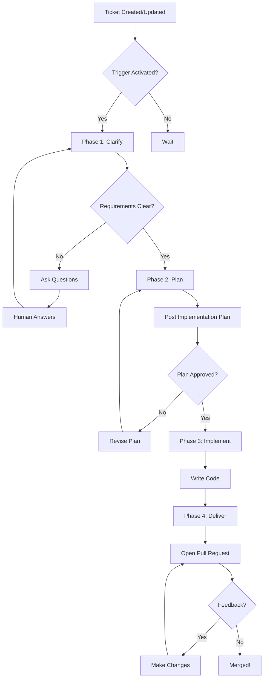

Otto is an **AI-powered development automation platform** that connects to your Linear and GitHub accounts to automate repetitive development tasks.

## What Otto Does

Otto acts as an AI teammate that can:

- **Clarify requirements** — Ask clarifying questions on Linear tickets before starting work
- **Plan implementations** — Create detailed implementation plans for complex features
- **Write code** — Generate production-ready code based on ticket requirements
- **Open pull requests** — Automatically create PRs with proper descriptions and linked issues
- **Respond to feedback** — Address code review comments and make requested changes

## How It Works

Otto follows a **4-phase lifecycle** that mirrors how senior engineers work, with human checkpoints at each stage:

### Phase 1: Clarify

**Goal:** Understand what needs to be built

- Otto reads the ticket description, acceptance criteria, and linked context
- Analyzes your codebase to understand existing patterns
- Identifies ambiguous or missing requirements
- Posts clarifying questions directly on the ticket as a comment
- **Human Checkpoint:** You answer the questions, Otto proceeds once requirements are clear

### Phase 2: Plan

**Goal:** Design the implementation

- Creates a detailed technical plan outlining the approach
- Identifies which files need changes and why
- Maps out the high-level architecture
- Posts the plan as a comment on the ticket
- **Human Checkpoint:** You review and approve the plan (or request changes)

### Phase 3: Implement

**Goal:** Write the code

- Creates a new branch from your default branch (e.g., `otto/TICKET-123-feature-name`)
- Implements the code following the approved plan
- Writes clean, well-structured code matching your existing patterns
- Makes multiple focused commits with clear messages
- Runs any configured linters or formatters

### Phase 4: Deliver

**Goal:** Submit for review

- Opens a pull request with a descriptive title and summary
- Links the PR to the original ticket
- Adds implementation notes and context
- Requests reviews from appropriate team members
- **Human Checkpoint:** You review the code, leave feedback, and merge when ready

### The Feedback Loop

After delivery, Otto stays active:

- Monitors the PR for review comments
- Reads and understands requested changes
- Makes the changes and pushes new commits
- Responds to comments explaining what was updated
- Repeats until the PR is approved and merged

This phased approach ensures Otto never goes off-track without human oversight, while still automating the repetitive work.

## What Otto Excels At

::list{type="success"}
- Repetitive coding tasks (CRUD operations, boilerplate)
- Well-defined tickets with clear requirements
- Bug fixes with clear reproduction steps
- Small to medium features with good specifications
- Responding to straightforward code review feedback
::

## What Otto Is NOT

::list{type="warning"}
- A replacement for developers — Otto is a force multiplier
- An architect for complex system design
- A solution for vague or undefined requirements
- A tool for security-critical code without review
::

## Next Steps

Ready to get started? Continue to the [Quickstart Guide](/docs/getting-started/quickstart) to set up Otto in 5 minutes.
